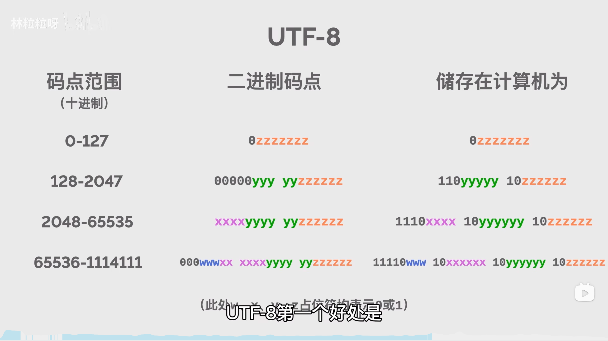

### 前提：计算机只能识别和存储 0 1 二进制码，所以我们所有的字符都需要经过转化变为二进制码才能被计算机识别。

###### 字符集 - 每一个二进制编码表示一个现实世界的文字符号。所有这些二进制编码的集合称之为字符集。

#### ASCII 字符集:美国信息交换标准代码，包括 -

1. 可见字符 --- 英文字母、数字、标点符号（共 95 个）
2. 控制字符 --- 回车、换行等等（共 33 个）

ASCII 字符串会在计算机被转化为 0-128（00000000 - 01111111）的二进制编码，即 ASCII 码。

#### GBK 字符集:中国使用的字符集

#### Unicode 字符集:全世界使用的字符集

###### 编码规则 - 由于除 ASCII 码外的其他字符，使用一个字节无法全部进行表示。所以需要制定一种能够在计算机中表示所有字符的编码规范，也就形成了各种编码规则。

#### utf-8 编码规则:使用 1-4 个字节编码表示所有字符

utf-8 每次传送 8 位数据，并且是一种可变长的编码格式。具体规则如下图:

####

<a href="https://www.rapidtables.org/zh-CN/code/text/unicode-characters.html">Unicode 字符集大全</a>

在 HTML 中转化 Unicode 字符表:

​ 只需以 &# 开头加对应的编号即可。例：你 === &#20320;
