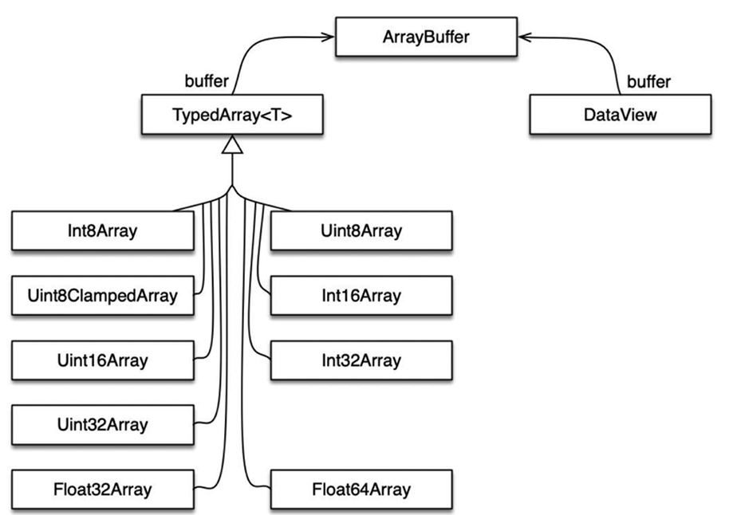
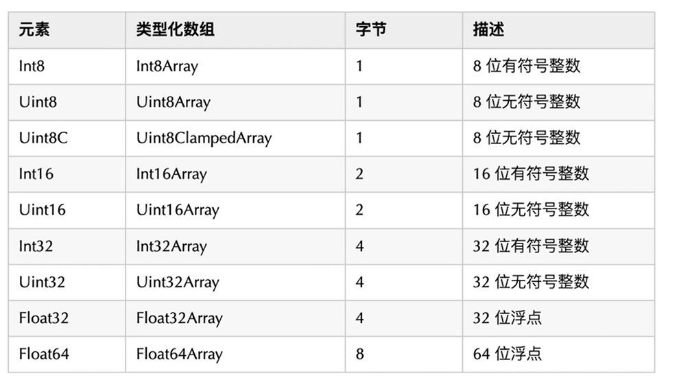

### `ArrayBuffer`

`ArrayBuffer` 对象用来表示通用的原始二进制数据缓冲区（官方定义），它是一个字节数组，通常在其它语言中称为‘byte array’。

可以把它理解为特殊的数组，特殊点在于：

1. 不能直接读写`ArrayBuffer`中的内容。需要通过`类型化数组对象（TypedArray）`或`DataView`对象来操作。这些对象会将缓冲区的数据表示为特定格式，并通过这些格式来读写缓冲区的内容。



> 可以将`ArrayBuffer`理解为相当于在内存缓冲区创建了一个盒子。
>
> `TypedArray` 和 `DataView` 的区别主要在 __字节序__, `TypedArray`的数组成员类型需一致。`DatatView`的数组成员可不同。



#### 用法：

创建对象：`new ArrayBuffer(length, options)`

两个参数：

1. length：要创建的数组缓冲区的大小（字节）。
2. options：有一个属性`maxByteLength`，数组缓冲区可以调整到的最大大小（字节），默认为0。

#### 示例1 - 使用 `typedArray` 操作`ArrayBuffer`

```js
// 创建一个1024字节的ArrayBuffer对象（相当于在内存缓冲区创建了一个盒子）
const arrBuffer = new ArrayBuffer(1024);
// 可以理解为 为 ArrayBuffer 这个盒子添加了一条往里面传输 Int8 字符类型的传输线
// 通过wrapBuffer将数据传输给这个盒子
const wrapBuffer = new Int8Array(arrBuffer);
// typedArray 的读写操作与普通数组没区别
// 传入数据（要检查输入的值是否超出这个类型的上限，超出上限显示会错误）
wrapBuffer[1] = 66;
// 读取数据并在控制台打印
console.log(wrapBuffer[1]);
```

#### 示例2 - 使用`DataView` 操作 `ArrayBuffer`

```js
const arrBuffer = new ArrayBuffer(1024);
// 创建一个DataView对象
const dataView = new DataView(arrBuffer);
// 与TypedArray不同的是，DataView提供了一系列的方法读/写数据
console.log(dataView);
// 写：set<Type>(index, value) - index表示要读取的字符的位置， value 要设置的值
dataView.setInt8(1, 99);
dataView.setFloat64(3, 9.99999999);
// 读：get<Type>(index) - index表示要读取的字符的位置
console.log(dataView.getInt8(1), ' ---- ', dataView.getFloat64(3));
```


### `ArrayBuffer` 与 Blob 的区别？

1. 根据`ArrayBuffer` 和 Blob 的特性，Blob作为一个整体文件，适用于传输。
2. 当需要对二进制数据进行操作时，可以使用 `ArrayBuffer`。
