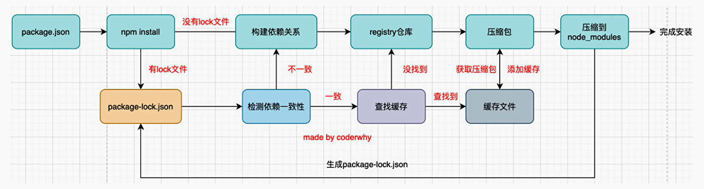

### 包管理工具

[NPM 包管理网站](https://www.npmjs.com/)

#### `npm` 的配置文件 `package.json`

对于一个项目来说，需要有一个记录管理包的配置文件。这个配置文件记录着`项目名称，版本号，项目描述，以及项目依赖的其它库的信息和依赖库的版本号`

##### 生成配置文件

1. `在对应文件夹下运行 npm init 生成初始化文件`
2. 各种脚手架工具自动生成。

##### 依赖包版本规范

`npm` 的包通常遵循 `semver版本规范`，即 `x.y.z`.

1. x - 主版本号：当做了不兼容的 API 修改（可能不兼容之前的版本）
2. y - 次版本号：当做了向下兼容的功能性新增（新增功能，但兼容以前版本）
3. z - 修订号：当做了向下兼容的问题修复（无新功能，修复了之前版本的 bug）

##### `package`中版本的描述

对某一个依赖包的版本描述一般分为两种（^ 或 ~）：

1. `"axios": "^1.1.1` ：表示 x 保持不变，y 和 z 永远安装最新的版本
2. `"axios": "~1.1.1` ：表示 x 和 y 保持不变，z 永远安装最新的版本

##### `package.json` 与 `package-lock.json` 的关系

1. `package.json` 记录的是依赖包所需的版本描述，不一定是具体的版本。`package-lock.json` 记录的是符合 `package.json` 版本描述的具体版本。
2. 当`package-lock.json` 存在，且锁定的版本与要下载的依赖版本一致时（安装时指定具体版本），则从从缓存中（如果有）安装 `package-lock.json` 的版本。
3. 当 `package-lock.json` 不存在，或记录的具体版本与要下载的版本不一致时时，则重新下载新依赖包。

#### `npm install` 原理

###### 查看缓存文件路径 `npm get cache`

#### `npx` - node 自带的工具

常见作用:

1.使用它来调用项目中某个模块的指令。
