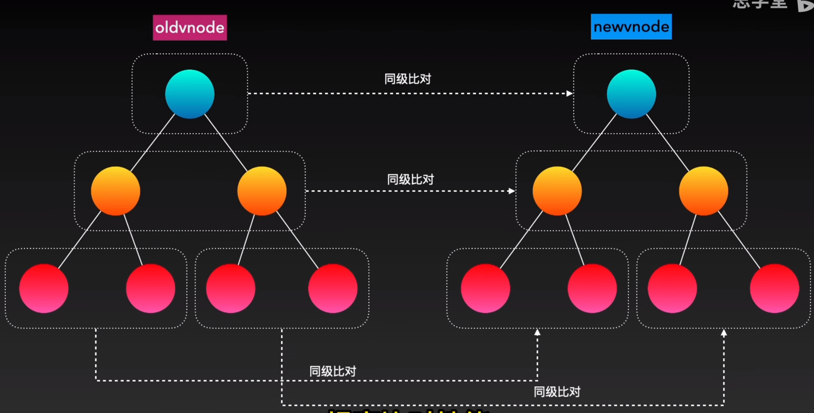

## diff 算法

###### 虚拟 DOM - 表示真实 DOM 的 js 对象

###### 因为 Vue 是声明式开发，声明式的更新性能消耗 = 找出差异的性能消耗 + 直接修改的性能消耗。虚拟 DOM 的意义就是于使找出差异的性能消耗最小化。

###### diff 算法作用：当 DOM 内容发生变化时，对比新旧两个虚拟 DOM，快速找到这两个虚拟 DOM 的差异，实现最小化更新视图（本质上就是比较两个对象的差异）

### Vue2diff

###### patch(oldVNode, newVNode)

##### updateChildren()方法 - 专门对比 oldVNode 与 newVNode 的子节点

###### updateChildren()方法特点：

1. 同级比较，提高对比性能。
   

### vue3 快速 diff

##### 快速 diff 分五个步骤：

1. 预处理==前置==节点
2. 预处理==后置==节点
3. 处理==仅有新增节点==情况
4. 处理==仅有卸载节点==情况
5. 处理==新增、卸载、移动==的混合复杂情况
