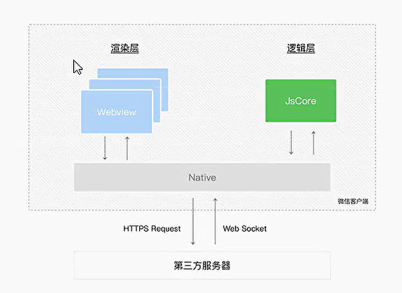

# 小程序架构与配置

### 小程序的架构模型

首先要认识到**小程序的宿主环境是微信客户端**。微信客户端将小程序的各种文件下载下来，然后解析执行。

**当小程序基于WebView环境时，WebView的`js`逻辑、DOM树创建、`css`解析、样式计算、layout、Paint都发生在同一线程，在WebView上执行过多的`js`逻辑可能造成阻塞渲染，导致页面卡顿。**

> WebView 是程序的一个控件，小程序运行时会将文件编译成WebView可以运行的对应的元素。（WebView可以理解为一个手机浏览器，内核是`webkit`,`js引擎是jsCore`。）

以上述为前提，小程序同时考虑了性能与安全，采用了目前的**双线程模型架构**。（跟浏览器渲染和`js`解析分开一样）



+ `wxml`模块和`wxss`样式运行于 **渲染层**，渲染层使用`WebView`线程渲染（一个程序有多个页面，会使用多个WebView的线程）
+ `js脚本`（app.js、xx.js等）运行于 **逻辑层**，逻辑层使用`jsCore`运行`js脚本`。
+ 这两个线程都会经由**微信客户端（Native）**进行中转交互。

> 看最新官方文档，不同设备微信小程序运行时是不同的，所以上述只看原理即可。

### Skyline渲染引擎

为了进一步优化性能，微信提供了**Skyline渲染引擎**.


## 小程序配置

小程序的很多开发需求（如头部title，底部信息等）被规定放在了**配置文件**中。常见的配置文件如下：

### 项目配置 `project.config.json`

```project.config.json
// 项目配置文件,如项目名称，appId等
{
  "compileType": "miniprogram",
  "libVersion": "trial", // 所用基础库版本
  "packOptions": {
    "ignore": [],
    "include": []
  },
  "setting": {
    "coverView": true,
    "es6": true,
    "postcss": true,
    "minified": true,
    "enhance": true,
    "showShadowRootInWxmlPanel": true,
    "packNpmRelationList": [],
    "babelSetting": {
      "ignore": [],
      "disablePlugins": [],
      "outputPath": ""
    }
  },
  "condition": {},
  "editorSetting": {
    "tabIndent": "auto",
    "tabSize": 2
  },
  "appid": "wxc1675569ff1adf7c"
}
```


### 搜索配置 `sitemap.json`

```json
// 配置小程序搜索相关
{
  "desc": "关于本文件的更多信息，请参考文档 https://developers.weixin.qq.com/miniprogram/dev/framework/sitemap.html",
  "rules": [{
  "action": "allow",
  "page": "*"
  }]
}
```


### 全局配置 `app.json`

```json
{
  // pages - 注册页面，所有页面必须在pages中进行注册（相当于vue-router）
  // pages 与项目pages目录联动 - 在pages目录下新增页面编辑器会自动添加到pages属性上，在pages属性上添加路径，也会在pages目录下创建对应的页面文件。
  "pages": [
    "pages/index/index",
    "pages/logs/logs"
  ],
  // window 表示整个小程序（窗口） 
  "window": {
    "navigationBarTextStyle": "black",
    "navigationBarTitleText": "polarBear",
    "navigationBarBackgroundColor": "#ffffff"
  },
  // 小程序底部的tab栏
  "tabBar": {
    "list": [
      {
        "pagePath": "pages/index/index",
        "text": "首页"
      },
      {
        "pagePath": "pages/favor/favor",
        "text": "喜爱"
      }
    ]
  },
  "style": "v2",
  "componentFramework": "glass-easel",
  "sitemapLocation": "sitemap.json",
  "lazyCodeLoading": "requiredComponents"
}

```

### 页面配置 `xx.json`

```json
// 单个页面配置 - 页面特定的配置，与全局配置属性相同时，替换掉全局配置
{
  "usingComponents": {},
  "enablePullDownRefresh": true, // 开启下拉刷新
  "navigationBarTitleText": "喜爱", // 页面特定title  
  "onReachBottomDistance": 100"  // 距离底部多少触发onReachBottom方法的回调函数，默认为0
}
```

### 小程序实例 `app.js`

```js
// app.js - 对应官方文档框架部分
// 本质上就是调用了App()函数，传入一个配置对象(注册小程序实例)
// App()函数会返回一个应用实例，在其他文件通过getApp()函数获取

// 注册App时常做事件
// 1.判断小程序进入场景
// 2.监听声明周期
// 3.因为App()实例只有一个，且全局共享（单例对象），所以可以共享一些数据
App({
    // 绑定对应的生命周期函数 - onLaunch 小程序初始化完成触发
    // onLaunch生命周期默认传参options
    onLaunch(options) {
        // 根据options.scene判断进入场景
        console.log(options)
        // 展示本地存储能力
        const logs = wx.getStorageSync('logs') || [];
        logs.unshift(Date.now());
        wx.setStorageSync('logs', logs);

        // 登录
        wx.login({
            success: (res) => {
                // 发送 res.code 到后台换取 openId, sessionKey, unionId
            },
        });
    },
    globalData: {
        userInfo: null,
    },
});

```

### 页面实例 `xx.js`

```js
```

